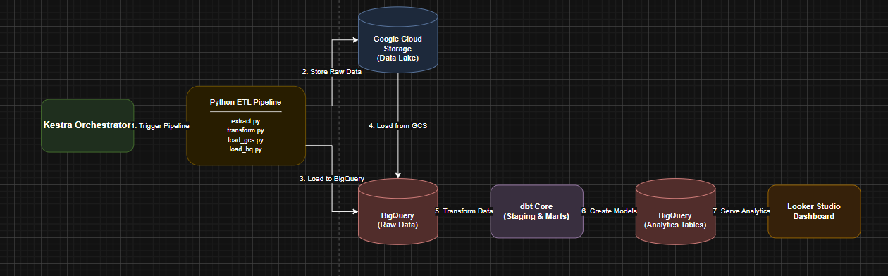
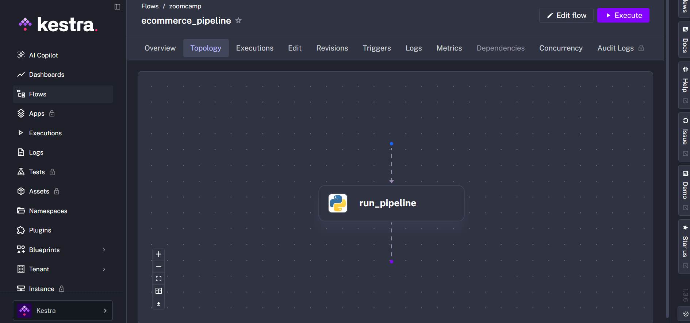
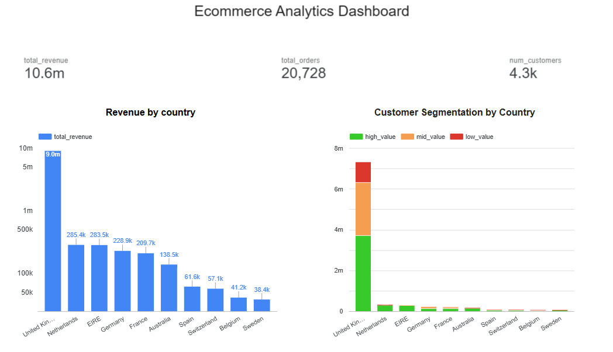
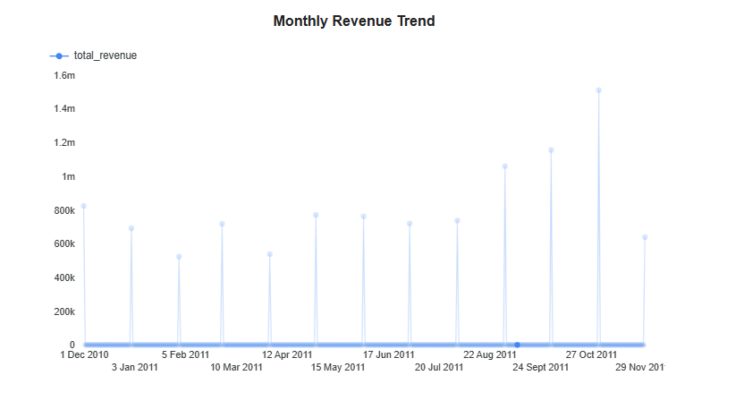

## 📌 Problem Statement

Ecommerce businesses generate large volumes of transactional data, but this data is often stored in raw formats that are not directly suitable for analysis. Without proper data pipelines, it becomes difficult to track key business metrics such as revenue trends, customer behavior, and country-level performance.

Manual analysis is time-consuming, error-prone, and does not scale with growing data.

💡 Solution

This project builds an end-to-end data pipeline that transforms raw ecommerce data into structured, analytics-ready datasets.

The pipeline:

Extracts raw data from the source dataset
Cleans and transforms it using Python
Stores raw and processed data in Google Cloud Storage (data lake)
Loads data into BigQuery as a data warehouse
Uses dbt to create structured data models for analytics
Orchestrates the pipeline using Kestra with scheduled daily runs
Visualizes key business insights in an interactive dashboard (Looker Studio)

This enables:

Scalable data processing
Automated and scheduled data workflows
Easy access to business insights such as revenue trends, customer segmentation, and geographic performance

## ⚙️ Tech Stack

The project uses a modern data engineering stack to build an end-to-end pipeline:

🐍 Programming Language
Python – used for data extraction, transformation, and loading
🐳 Containerization
 Docker & Docker Compose – used to containerize services such as Kestra and manage the project environment
🔄 Orchestration
Kestra – manages and schedules the ETL pipeline using daily cron triggers
☁️ Data Lake
Google Cloud Storage (GCS) – stores raw and processed data files
🏢 Data Warehouse
BigQuery (EU region) – scalable cloud data warehouse for analytics
🧱 Data Transformation
dbt (Data Build Tool) – used to create staging and mart models for analytics
📊 Data Visualization
Looker Studio – interactive dashboard for business insights
🛠 Other Tools
Git & GitHub – version control and project hosting

## 🏗 Architecture

The pipeline is orchestrated using Kestra, which triggers a Python-based ETL process. The ETL scripts handle data extraction, transformation, and loading into both Google Cloud Storage (data lake) and BigQuery (data warehouse). The pipeline components are containerized using Docker to ensure a consistent and reproducible environment.

Data stored in BigQuery is further transformed using dbt to create structured staging and mart models optimized for analytics.

The final transformed datasets are used to power an interactive dashboard in Looker Studio.



## 📂 Project Structure

```The project is organized into modular components, separating ETL, transformation, and orchestration layers.

FINAL_CAPSTONE_PROJECT/
│
├── ecommerce_pipeline/          # Python ETL pipeline
│   ├── pipeline/
│   │   ├── extract.py           # Extract raw data
│   │   ├── transform.py         # Data cleaning & preprocessing
│   │   ├── load_gcs.py          # Upload data to GCS
│   │   └── load_bq.py           # Load data into BigQuery
│   ├── data/                   # Raw dataset
│   ├── run_pipeline.py         # Run full ETL pipeline
│   ├── convert_to_csv.py       # Data preparation utility
│   ├── requirements.txt        # Python dependencies
│   └── .gitignore
│
├── dbt_ecommerce/              # dbt project
│   ├── ecommerce_project/
│   │   ├── models/
│   │   │   ├── staging/
│   │   │   │   └── stg_online_retail.sql
│   │   │   └── marts/
│   │   │       ├── revenue_by_country.sql
│   │   │       ├── customer_segments.sql
│   │   │       └── monthly_revenue.sql
│   │   ├── schema.yml
│   │   └── dbt_project.yml
│   └── logs/
│
├── kestra_ecommerce/           # Kestra orchestration
│   ├── flows/ (or application.yml)
│   └── docker-compose.yml
│
├── images/                     # Diagrams for README
│   └── architecture.png
│
├── gcp-key.json                # GCP credentials (not commited)
└── README.md ```

## 🔄 Workflow Orchestration (Kestra)

Kestra is used to orchestrate the ETL pipeline and automate its execution. A workflow is defined to trigger the Python ETL process, ensuring that data is extracted, transformed, and loaded in the correct sequence.

The workflow is scheduled using a cron-based trigger to run daily at 6:00 AM, enabling automated and consistent data updates. Kestra manages task execution and ensures the pipeline runs reliably without manual intervention.

### Kestra Workflow


### Kestra Topology



## 🧱 dbt Data Modeling

The project uses dbt to transform raw data in BigQuery into structured, analytics-ready models. The transformations are organized into two layers:

Staging Layer
Cleans and standardizes raw data from BigQuery
Example: stg_online_retail

Mart Layer
Builds business-level aggregations for analysis and reporting
Models:
revenue_by_country
customer_segments
monthly_revenue

This layered approach ensures clear separation between raw data preparation and business logic, making the models easier to maintain and extend.

## 📊 Visualization

The dashboard presents key business insights such as revenue trends, customer segmentation, and country-level performance.

🔗 [View Live Dashboard](https://lookerstudio.google.com/reporting/0e32aae7-0a37-4bcb-9f71-880639100c0a)

### Revenue by Country & Customer Segmentation



### Monthly Revenue Trend



🚀 Steps to Reproduce

Follow these steps to run the project end-to-end:

1. Clone the Repository
git clone https://github.com/Hamzaayaz95/end-to-end-ecommerce-data-pipeline.git

cd end-to-end-ecommerce-data-pipeline

2. Set Up Environment

Create a virtual environment and install dependencies:

python -m venv venv
source venv/bin/activate   # On Windows: venv\Scripts\activate

pip install -r ecommerce_pipeline/requirements.txt

3. Configure Google Cloud
Create a Google Cloud project
Enable:
BigQuery API
Cloud Storage API
Create a service account and download the JSON key
Place the key in the project root:
gcp-key.json
Set environment variable:
export GOOGLE_APPLICATION_CREDENTIALS="gcp-key.json"
# On Windows:
set GOOGLE_APPLICATION_CREDENTIALS=gcp-key.json

4. Run the ETL Pipeline
cd ecommerce_pipeline/pipeline

python extract.py
python transform.py
python load_gcs.py
python load_bq.py

5. Run dbt Models
cd ../../dbt_ecommerce/ecommerce_project

dbt run

6. (Optional) Run with Kestra
Start Kestra using Docker:
docker-compose up
Trigger the workflow or wait for scheduled run (daily at 6 AM)

7. View Dashboard
Open Looker Studio
Connect to your BigQuery dataset
Use the provided dashboard template or create charts:
Monthly Revenue Trend
Revenue by Country
Customer Segmentation

✅ Expected Output
Data loaded into BigQuery
dbt models created successfully
Dashboard displaying updated analytics

### 🔮 Future Improvements

Extend the pipeline to support real-time data processing using streaming technologies
Integrate additional data sources (e.g., web analytics, marketing data) for richer insights
Enhance the dashboard with advanced analytics such as forecasting and anomaly detection
Implement role-based access control for secure data access
Deploy the pipeline to a cloud-based production environment for scalability
Add monitoring and alerting to track pipeline performance and failures
